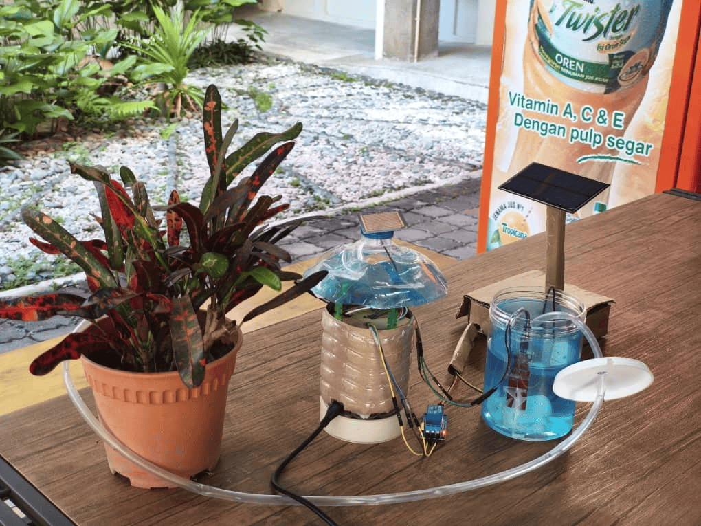

## 🌱 Smart Garden Dashboard

An IoT-enabled smart irrigation and monitoring system designed to support sustainable urban gardening.
This project combines real-time sensor monitoring, automated irrigation control, and a modern web interface using Next.js, Supabase, and MQTT.

The system is aligned with smart city concepts and SDG 11 (Sustainable Cities and Communities) by promoting efficient water usage and intelligent environmental management.




## ✨ Key Features

- **Live Dashboard:** Visualize temperature, humidity, soil moisture, and weather data from IoT sensors.
- **Manual & Auto Control:** Switch between automatic and manual pump control for irrigation.
- **Calibration:** Adjust sensor thresholds and calibration settings for optimal plant care.
- **Realtime Updates:** Data is fetched live from Supabase and device commands are sent via MQTT.
- **Modern UI:** Responsive, sidebar-driven layout with Lucide icons and Recharts for data visualization.


## Dependencies

The project uses the following runtime and development dependencies (as listed in `package.json`):

- Runtime dependencies:
	- `@supabase/supabase-js` ^2.89.0
	- `lucide-react` ^0.562.0
	- `mqtt` ^5.14.1
	- `next` 16.1.0
	- `react` 19.2.3
	- `react-dom` 19.2.3
	- `recharts` ^3.6.0

- Dev dependencies:
	- `@tailwindcss/postcss` ^4
	- `@types/node` ^20
	- `@types/react` ^19
	- `@types/react-dom` ^19
	- `eslint` ^9
	- `eslint-config-next` 16.1.0
	- `tailwindcss` ^4
	- `typescript` ^5

## 🚀 Getting Started

1. **Install dependencies:**
	```bash
	npm install
	# or
	yarn install
	```

2. **Set up environment variables:**
	- Create a `.env.local` file in the root directory.
	- Add your Supabase project URL and anon key:
	  ```env
	  NEXT_PUBLIC_SUPABASE_URL=your-supabase-url
	  NEXT_PUBLIC_SUPABASE_ANON_KEY=your-supabase-anon-key
      NEXT_PUBLIC_WEATHER_API_KEY=your-weather-api-key
	  ```

3. **Run the development server:**
	```bash
	npm run dev
	# or
	yarn dev
	```
	Open [http://localhost:3000](http://localhost:3000) in your browser.

	### Build for production

	```bash
	npm run build
	npm start
	```
## Project Structure
- `app/` — Main Next.js app directory (pages, API routes)
- `components/Sidebar.jsx` — Sidebar navigation
- `lib/supabase.js` — Supabase client setup
- `public/` — Static assets

## Key Pages

- **Dashboard:** `/dashboard` — Live sensor data and charts
- **Calibration:** `/calibration` — Adjust sensor thresholds
- **Manual Control:** `/manual-control` — Directly control irrigation pump

## API & IoT Integration

- **Supabase:** Stores and retrieves sensor data
- **MQTT:** Sends pump control commands to ESP32/IoT device via `/api/pump`

## ⚙ Customization

- Update MQTT broker address in `app/api/pump/route.js` if needed.
- Adjust Supabase table/column names in `lib/supabase.js` and dashboard code as per your schema.


## ESP32 / Arduino (Cpc357_project.ino) 

This project expects sensor data and pump commands to be exchanged over MQTT. Below is a minimal ESP32 sketch (Arduino framework) that:

- connects to Wi‑Fi
- publishes sensor readings to a topic like `myhome/garden/data`
- subscribes to `myhome/garden/command` for pump ON/OFF commands

Replace `WIFI_SSID`, `WIFI_PASS`, and `MQTT_BROKER` with your values before uploading.


Notes:
- Use the `PubSubClient` library in the Arduino IDE or PlatformIO.
- Wire the soil moisture, DHT, and relay modules according to your ESP32 board pinout.
- Secure your MQTT broker in production (authentication/TLS).

## GCP VM — MQTT broker (Mosquitto) setup

You can host an MQTT broker on a GCP Compute Engine VM. The steps below outline creating an Ubuntu VM, installing Mosquitto, and exposing port `1883`.

1. Create a new Compute Engine VM (Ubuntu 22.04) and assign an external IP.
2. Allow ingress on TCP port `1883` in the VM's firewall (VPC → Firewall rules).
3. SSH into the VM and run:

```bash
sudo apt update
sudo apt install -y mosquitto mosquitto-clients
sudo systemctl enable --now mosquitto
```

4. (Optional) Configure authentication by editing `/etc/mosquitto/mosquitto.conf` and adding a password file:

```bash
sudo mosquitto_passwd -c /etc/mosquitto/passwd username
# then add to mosquitto.conf:
# allow_anonymous false
# password_file /etc/mosquitto/passwd
sudo systemctl restart mosquitto
```

5. Update your app to point to the VM's external IP in `app/api/pump/route.js` (replace the `MQTT_BROKER` constant) or set an env variable and use it in your code.

Example `MQTT_BROKER` value:

```
mqtt://YOUR_VM_EXTERNAL_IP:1883
```


